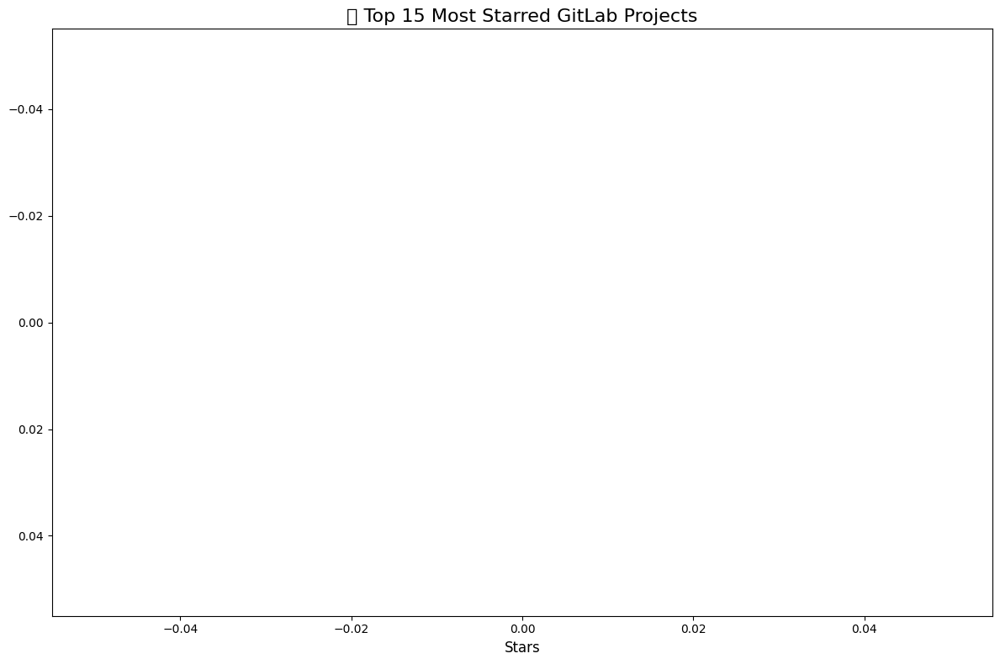

# GitLab Open Source Project Analysis 📊

> Analyzing 100+ GitLab-hosted open source projects — their popularity, activity, and trends.

## 🔍 What This Project Does

1. **Fetches** 100+ projects from GitLab's public API
2. **Analyzes** with SQL (stars, forks, activity)
3. **Visualizes** key insights with charts

## 📈 Key Visualizations

### Top 15 Most Starred Projects

### Stars vs Forks (Popularity vs Contribution)
.png)

### Distribution of Stars
.png)

### Activity Timeline (2020-2026)
.png)

## 📊 Key Insights

| Metric | Value |
|--------|-------|
| Projects analyzed | 100+ |
| Total stars | [0] |
| Average stars | [0] |
| Most active year | [2026] |

## 🛠️ Skills Demonstrated

- **API Integration**: GitLab REST API
- **Data Processing**: Python (requests, pandas)
- **SQL Analysis**: SQLite queries
- **Data Visualization**: Matplotlib, Seaborn
- **Version Control**: Full Git workflow

## 🚀 How to Run

1. Open [Google Colab](https://colab.research.google.com)
2. Upload `gitlab_analysis.ipynb`
3. Run all cells
4. View charts + insights

---

*Built entirely in browser — no local setup required.*
